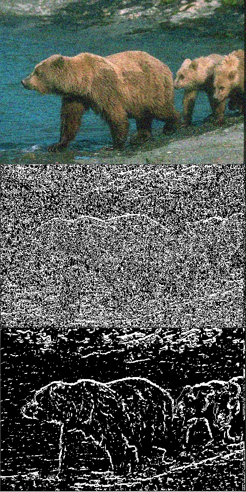
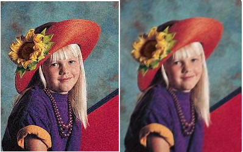
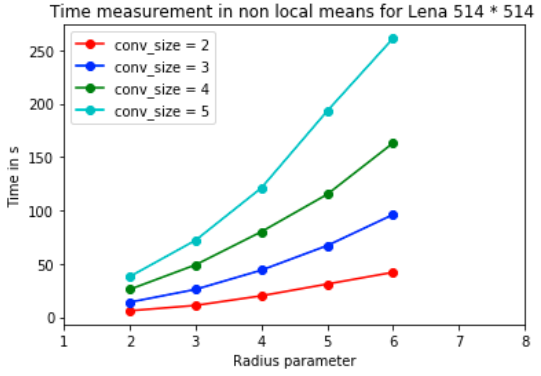
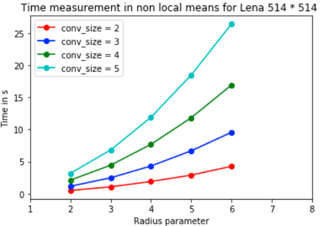
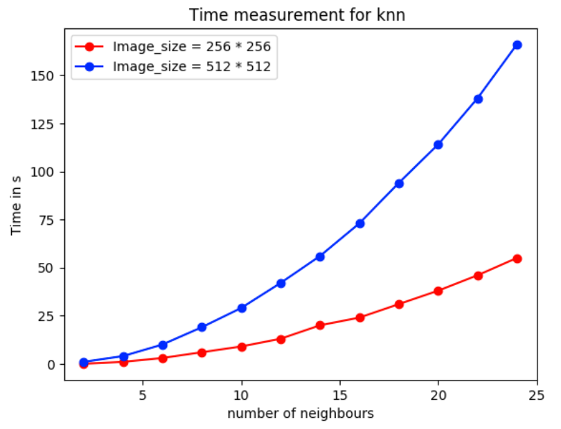
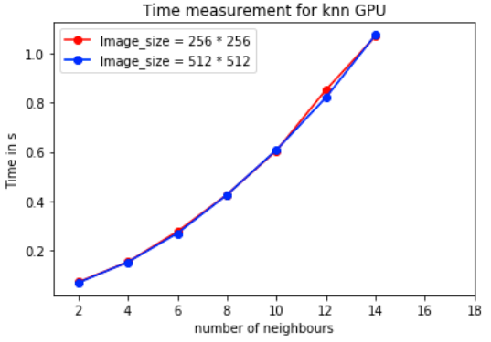
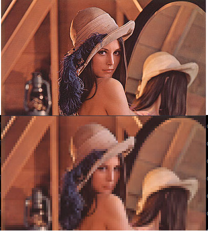

# Image Processing with CUDA C++

## Objective
The objective of this project is to implement from scratch in CUDA C++ various image processing algorithms.
A Cpu and a Gpu version of the following algorithms is implemented and commented:
- Canny Edge Detection
- Non Local-Means De-Noising
- K-Nearest Neighbors De-Noising
- Convolution Blurring
- Pixelize

We benchmarked the [Gpu](https://github.com/ConsciousML/canny-edge-cuda/blob/master/src/gpu/bench/benchs.ipynb) and [Cpu](https://github.com/ConsciousML/canny-edge-cuda/blob/master/src/cpu/bench/benchs.ipynb) version.

## Setup:
Make sure you have a CUDA capable GPU and install cudatoolkit for your OS.
Then run:
```bash
    cd src/gpu
    mkdir build && cd build
    cmake ..
    make
```

## Algorithms :
### Canny Edge Detection

<br>
Detects the edges of an image.
<br>

Usage:
```bash
    ./main <image_path> edge_detect
```

### Non Local-Means De-noising

<br>
Removes the grain of an image.
<br>
Benchmark:
- Cpu:



- Gpu:



Usage:
```bash
    ./main <image_path> nlm <conv_size> <hyper_param>
```

### K-Nearest Neighbors De-noising

<br>
Removes the noise of an image using the KNN algorithm.
<br>
Benchmark:
- Cpu:



- Gpu:



Usage:
```bash
    ./main <image_path> nlm <conv_size> <block_radius> <weight_decay>
```

### Convolution Blurring

<br>
Blurs an image using the convolution operator.
<br>
Usage:
```bash
    ./main <image_path> conv <conv_size>
    ./main <image_path> shared_conv <conv_size>
```
Use `shared_conv` for an optimized version using shared memory.

### Pixelize

<br>
Pixelizes an image.
<br>
Usage
```bash
    ./main <image_path> pixelize <conv_size>
```
